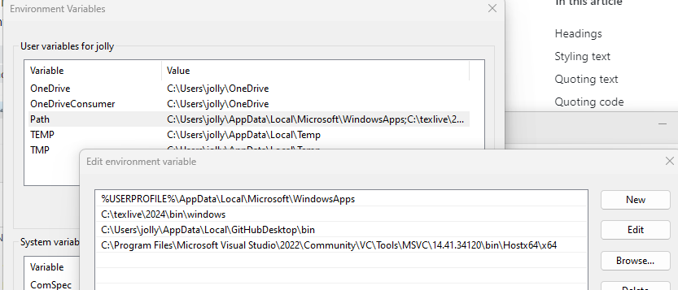
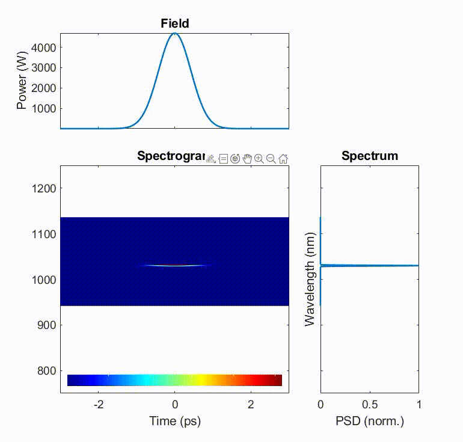
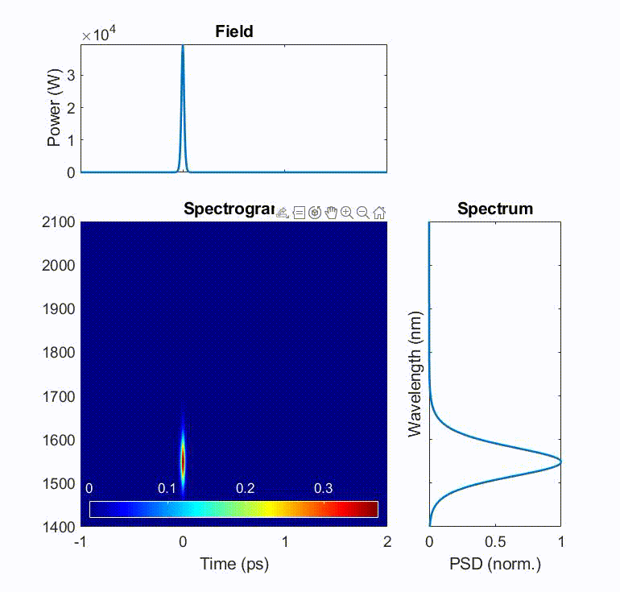
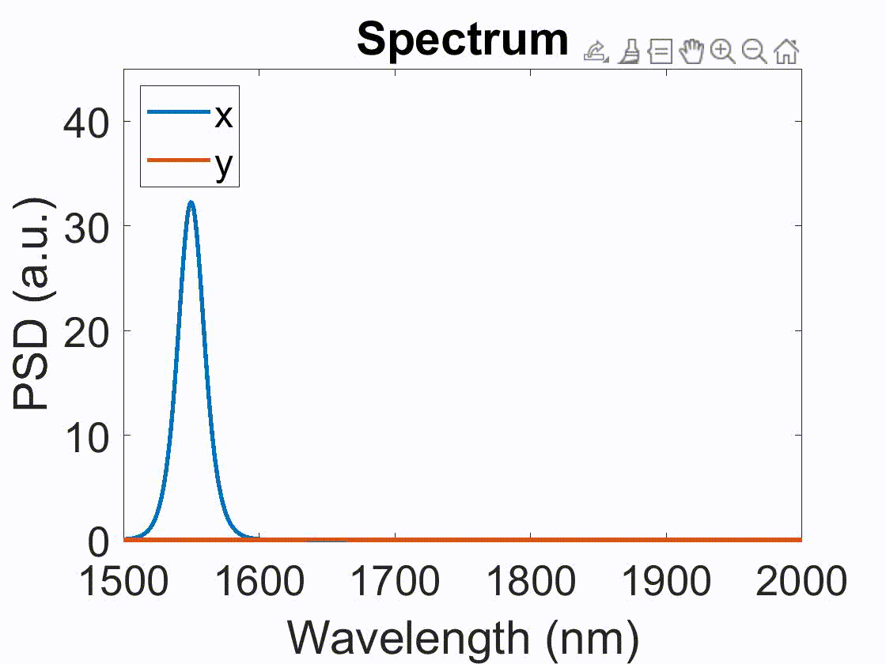
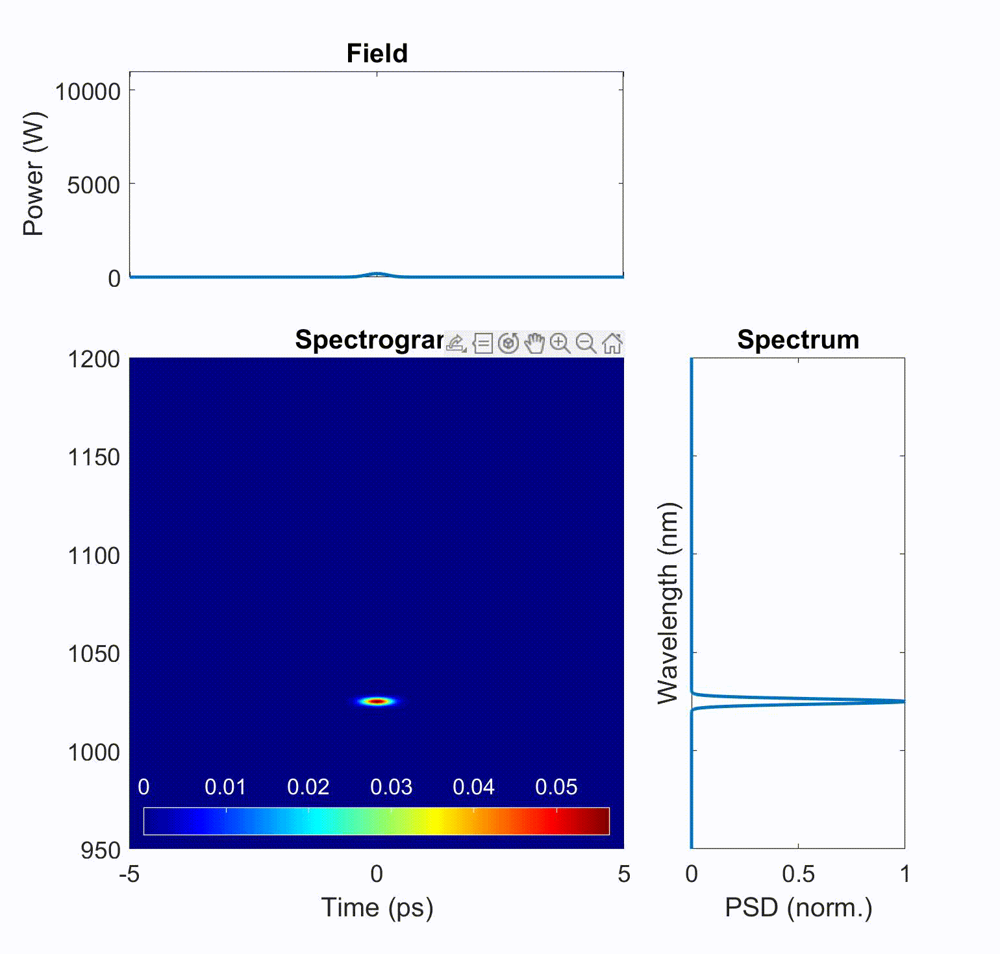
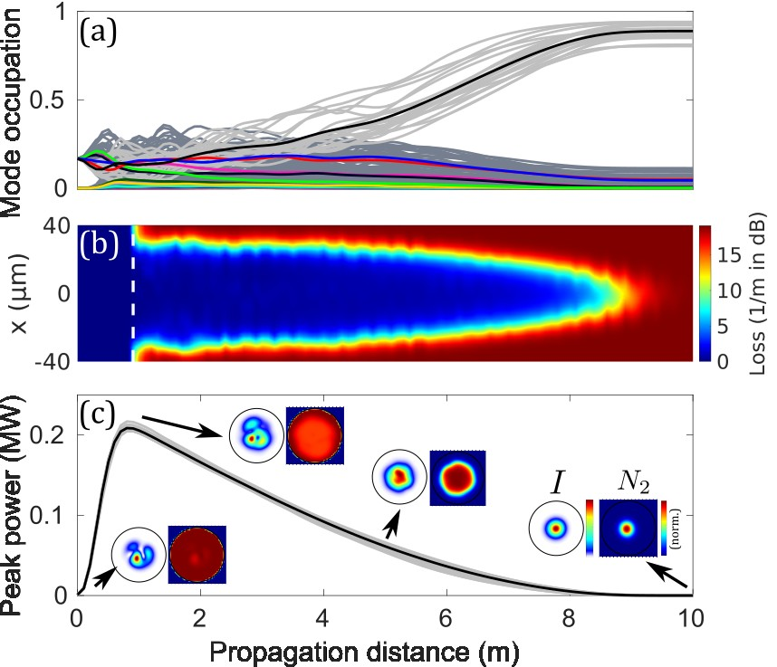
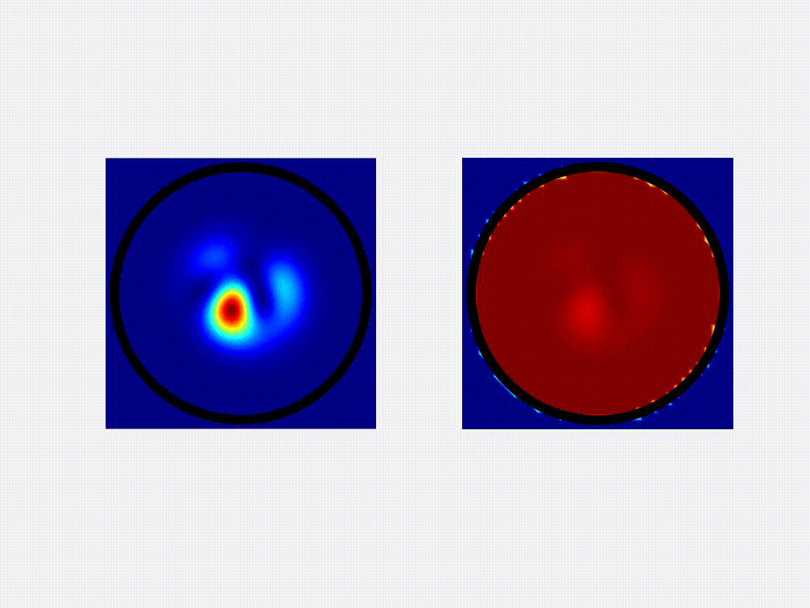
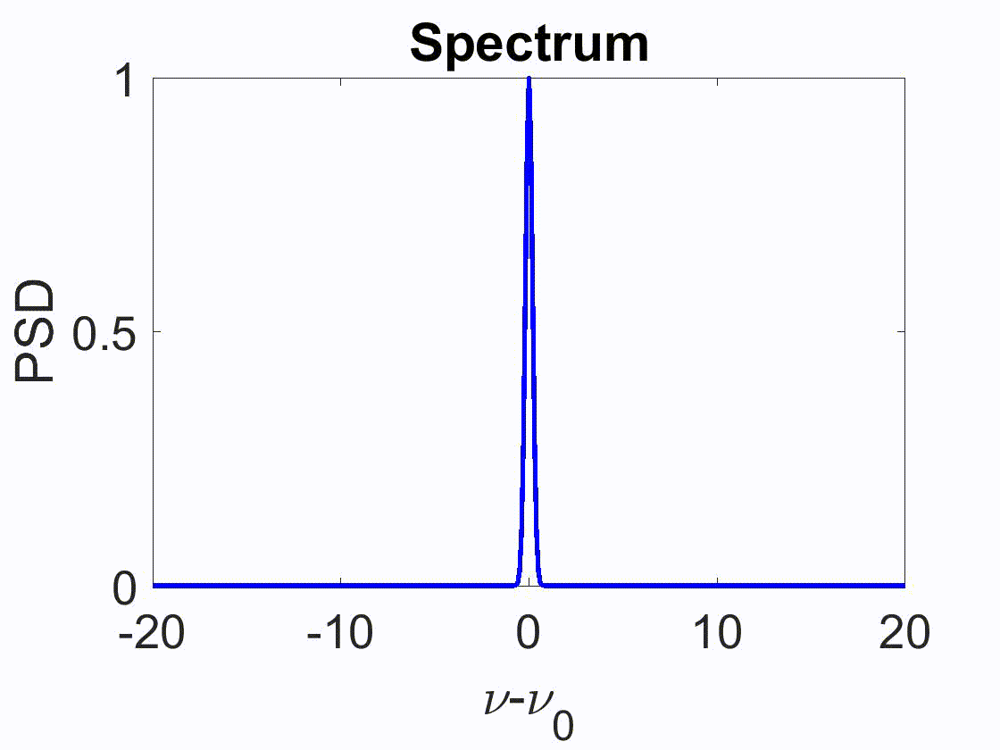
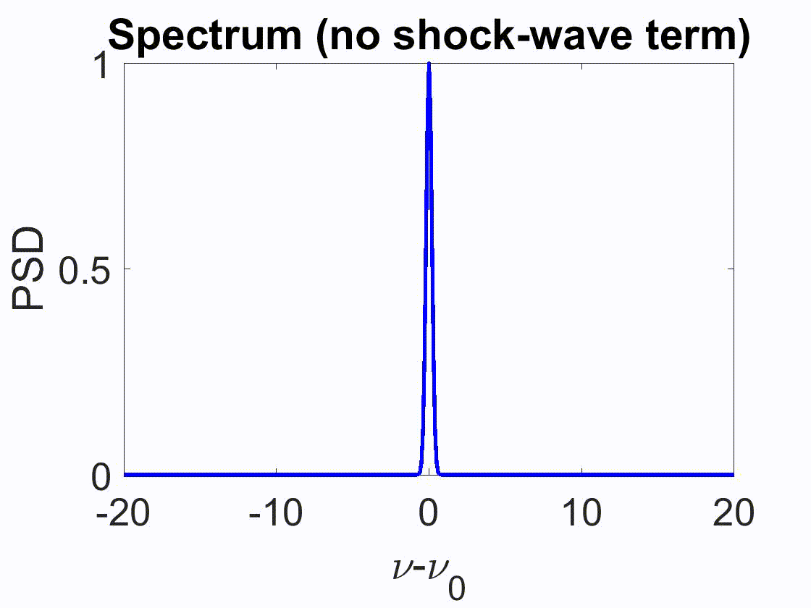

# MMTools
This is the shared package to simulate, with MATLAB, pulse propagation in  
1. non-waveguide: free space with 3D-UPPE
2. waveguide: a solid-core fiber with GMMNLSE/MM-UPPE

It is useful for simulating single-mode/multimode mode-locking/oscillators, fiber amplifiers, single-mode/vector/multimode solitons, spatial beam cleaning in multimode fibers, fiber optical parametric amplifier (FOPA), and so on. Some typical examples of oscillators include all-normal-dispersion (ANDi) oscillators and Mamyshev oscillators. Amplifiers include linear chirped-pulse amplification (CPA) and gain-managed nonlinear amplification (GMNA).

## Capabilities: 
1. It solves the pulse propagation with
   - [RK4IP](http://www.sciencedirect.com/science/article/pii/S0010465512004262) (Runge-Kutta under the interaction picture) if single-mode.
   - [MPA](https://ieeexplore.ieee.org/document/8141863) (massively parallel algorithm) if multimode.

> [!NOTE]
> I know that split-step algorithm is common, but I'd like to advocate people to switch to RK4IP since RK4IP has a higher-order truncation error, which allows higher precision or larger step size (and faster simulation).

2. Adaptive step-size control are implemented for both RK4IP and MPA, which improves the performance and allows users to be free from worrying the reliability of a simulation. Only under limited scenarios is adaptive-step method turned off, such as considering ASE and using `saved_data` for fast oscillator convergence. User doesn't choose whether to use the adaptive-step method, which is controlled by this package.

> [!NOTE]
> Although adaptive-step-size control for RK4IP isn't new with published papers, adaptive-step-size control for MPA is new. I didn't publish a separate paper discussing this numerical scheme, which is perhaps the fastest and the most convenient numerical scheme for general multimode situations (as in step-index, graded-index, or hollow-core fibers, etc.) by far (written on 2/14/2024). The implementation detail is described in the supplement of [[1]](#references-our-papers).

3. Support broadband scenarios by having $\beta_p(\omega)$. Please see the "Broadband SPM-based supercontinuum" examples and understand the necessity of applying this scheme in some situations.
4. Support both scalar and polarized scenarios, controlled with `sim.scalar=true/false`.
5. Support random mode coupling.
6. Support both passive and gain fibers
   - Gain model includes Gaussian gain and rate-equation gain, for both single-mode and multimode scenarios.
   - For rate-equation-gain modeling, all pumping schemes are implemented: co-pumping, counter-pumping, co+counter-pumping, as well as with and without ASE.
   - If ASE is included, the effect of ASE to the coherent signal field is simulated, rather than only a separate "power" variable $P_{\text{ASE}}(\omega)$ from the coherent signal "field" $A(t)$.
   - Rate-equation model supports `Nd`, `Yb`, `Er`, `Tm`, `Ho`. For more details, see `readme.pdf`.
   - Support ring- and linear-oscillator configurations with fast convergence (with the use of `saved_data`). For linear oscillators, inclusion of influence from pulses of both directions to the gain medium is considered. As an example, please see the numerical section of [our paper](http://josab.osa.org/abstract.cfm?URI=josab-38-3-743) to understand the necessity of this two-pulse saturation effect in a linear oscillator.
7. Support noise-seeded processes, such as spontaneous Raman scattering, with [the newly-developed noise model](https://doi.org/10.48550/arXiv.2410.20567).
8. For multimode, GPU computations (with Nvidia CUDA) is highly recommended. I have written a lot of CUDA files to speed up simulations. It is controlled by `sim.gpu_yes=true/false`.

## Notes: 
For details, please read the supplement of [[1]](#references-our-papers).  
Please don't forget to cite our paper if you find this code useful in your work. I, the young and early-career researcher, need your support. Similarly, if you need help or have questions about the code, please feel free to ask them here or send me an email (email address is in my paper).

There is a `readme.pdf` in the `Documentations/` folder. Please find details of how to use this code in it. However, the fastest way to learn how to use this package is to learn from the examples in the `Examples/` folder.

I'm Yi-Hao Chen, the author of the code and from Frank Wise's group at Cornell Applied Physics. This code is basically an upgraded and highly-optimized version of our [WiseLabAEP/GMMNLSE-Solver-FINAL](https://github.com/WiseLabAEP/GMMNLSE-Solver-FINAL) with much more functionalities, which however might overwhelm users and thus require more fiber-optic background. It can run order-of-magnitude faster than our old code due to optimizing with CUDA+shared memory, as well as reducing the usage of for-loops. Although our old one claims to be fast with GPU, its CUDA implementation is not optimized, let alone its CPU implementation with a lot of slow for-loops. Besides, this package includes adaptive step-size control, which improves the performance significantly and allows users to be free from worrying the reliability of a simulation. For optimization details, please see the supplement of our paper mentioned previously. 

## How to activate CUDA for GPU computing in MATLAB: 
Typically MATLAB deals with this, but there are still come steps to follow before CUDA can really be used, especially when compiling .cu files to generate .ptx files. Below I show only steps for Windows. For linux, please search for their specific steps. I've never used Mac, so I cannot comment anything on this; some functions need to be revised for extended capabilities for Mac as far as I know. 
1. Install [CUDA Toolkit](https://developer.nvidia.com/cuda-toolkit)
2. Install [Visual Studio Community](https://visualstudio.microsoft.com/vs/community/). Only **Desktop development with C++** is required. If it later says that it needs to install some other components due to the dependency issues, also install them.

3. Add required path of Visual Studio to computer's environmental PATH; otherwise, MATLAB, during compiling .cu files, will say "cl.exe" cannot be found.

4. Restart the computer if something is wrong. Connections between MATLAB and CUDA or Visual Studio requires restarting to be effective.
> [!WARNING]
> MATLAB supports only a certain version of CUDA and GPUs ([support list](https://www.mathworks.com/help/releases/R2021b/parallel-computing/gpu-support-by-release.html)). CUDA or GPU that is too old just isn't supported.

## References (our papers): 
1. [Multimode gain](https://doi.org/10.1364/JOSAB.500586)
2. [Raman scattering](https://doi.org/10.1063/5.0189749)
3. [Noise modeling](https://doi.org/10.48550/arXiv.2410.20567)

## Demonstrations: 
- **Self-steepening**  
The pulse's peak shifts in time, creating a sharp temporal edge.   
Source: "Examples\Some tutorials\10. Self-steepening_Shock wave"  

- **Soliton self-frequency shift (SSFS)**  
The soliton redshifts due to intrapulse Raman scattering.  
In the animation, it shifts in time because redshifting makes the pulse slows down (in an anomalous-dispersion environment), slower than the user-defined moving window.  
Source: "Examples\Some tutorials\6. Soliton self-frequency shift"  

- **Orthogonally-polarized Raman coupling**  
The soliton couples its energy from one polarization mode to the other, while redshifting due to SSFS.  
Source: "Examples\Orthogonally-polarized Raman scattering"  

- **Gain-managed nonlinear amplification (GMNA)**  
The pulse is amplified in an Yb-doped fiber amplifier, along with the gain management of a spectrally-shifting gain spectrum as the pulse is amplified. This is a new recently-discovered amplification, called [GMNA](http://www.osapublishing.org/optica/abstract.cfm?URI=optica-6-10-1328).  
Source: "Examples\Gain-rate-equation model\GMNA\Yb GMNA"  

- **Loss-enhanced (spatiotemporal-dissipation-enhanced) Kerr beam cleaning**  
The multimode pulse experiences Kerr-induced beam cleaning into the fundamental Gaussian mode during amplification. Because the fundamental mode experiences less absorption from the gain fiber, gain/loss effect facilitates beam cleaning. See [[1]](#references-our-papers) for details.  
The animation shows the evolutions of the (left) optical spatial profile and the (right) upper-state population (related to inversion).  
Source: "Examples\Loss-enhanced beam cleaning"  

## Self-steepening/shock-wave effect
Since I received many questions about whether this code includes the self-steepening/shock-wave term, I will explain it here.  
Self-steepening, or shock wave, results from the nonlinear intensity-dependent group velocity which arises from the "frequency dependence of the nonlinearity". This term is included in UPPE with a $\omega$ nonlinear prefactor, rather than the simplified $\omega_0(1+\frac{i}{\omega_0}\partial_t)$ Taylor-series first-order approximation. By solving in the frequency domain with the $\omega$ prefactor, frequency dependence of the nonlinearity is included to all orders, including the first-order self-steepening/shock-wave effect.  
This effect creates a self-steepening sharp temporal edge during nonlinear evolution (see **Self-steepening example** in [Demonstrations](#demonstrations) above). Moreover, it creates an asymmetrical spectral broadening (see the left animation below), which is crucial to satisfy the photon-number conservation. During spectral broadening, two pump photons transfer the energy to one red and one blue photons. Since a bluer photon has a higher photon energy, the power spectral density at blue colors should be smaller than the red one to maintain both the energy and photon-number conservation. Typical nonlinear Schrödinger equation, if ignoring the first-order shock-wave prefactor, creates only symmetical spectral shape (see the right animation below), fundamentally violating the photon-number conservation.
  
Please see the supplement of [[2]](#references-our-papers) for the derivation of MM-UPPE and understand how the shock-wave term appears.  
Shock-wave effect cannot be turned off in this package. I specifically created another code privately for the animation demonstration in this section.

## History: 
* 11/1/2023: 
If you downloaded the code earlier, please re-download it. There was a huge bug in polarization modes. I fixed it only recently. Now it works correctly.
* 1/17/2024: 
Since I've received questions about the Fourier Transform, I've added explanation about it in the readme.pdf. Because of the laser-field definition, Fourier Transform should be `ifft` in MATLAB; be careful about this! It's different from the mathematical convention. This affects phase results and even critical (and can make the result wrong) Fourier-Transform-constant issues, such as different constants of convolution theorem for different conventions.
* 7/17/2024: 
I've fixed bugs related to multimode mode-locking. Thanks Yi Zhou, from Univeristy of Hong Kong, for asking me to add examples for a few multimode functions. Please check the "MM ANDi" example in "ANDi oscillator/" folder in "Examples/". In addition, I've finished implementing all types of gain media. Please take a look. More tests need to be done.  
Addition of ASE to the coherent signal field is corrected, which was wrong previously. See the comments in the `stepping_RK4IP/MPA_rategain.m` for details.
* 8/15/2024: 
I modified the populations used in rate-eqn-gain modeling from the 2nd level to the highest level ($N_1$ to $N_m$), which was the ground level to the second highest level ($N_0$ to $N_{m-1}$) before. This is to conform with another model I'm currently developing and will hopefully be released soon. Additionally, I updated the 3D-UPPE code for free-space modeling.
* 10/31/2024: 
Update the code with the newly-developed noise model with [the finally-published paper](https://doi.org/10.48550/arXiv.2410.20567).
* 11/13/2024: 
Fix the bug of the Raman computation in 3D-UPPE. It was wrong before. Thanks to Su-cc for finding it, which isn't easy to find.